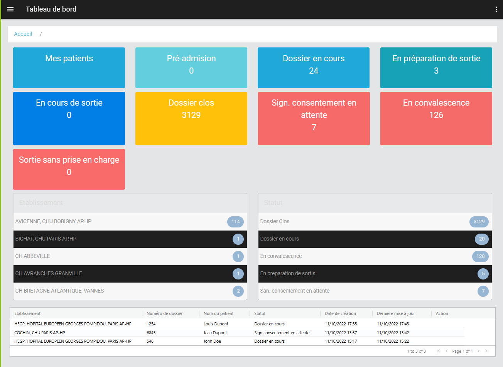

# ticketing_demo

A ticketing Dashbaord Demo


For more technical informations : [documentation](./project.md)

- [Installation](#installation)
- [Mobile Application](#mobile-application)
    - [Pages](#pages)
        - [Page](#page)


## Installation

1. In your Convertigo Studio click on  to import a project in the treeview
2. In the import wizard

   
   
   paste the text below into the `Project remote URL` field:
   <table>
     <tr><td>Usage</td><td>Click the copy button at the end of the line</td></tr>
     <tr><td>To contribute</td><td>

     ```
     ticketing_demo=https://github.com/convertigo/c8oprj-ticketing-demo.git:branch=master
     ```
     </td></tr>
     <tr><td>To simply use</td><td>

     ```
     ticketing_demo=https://github.com/convertigo/c8oprj-ticketing-demo/archive/master.zip
     ```
     </td></tr>
    </table>
3. Click the `Finish` button. This will automatically import the __ticketing_demo__ project


## Mobile Application

Describes the mobile application global properties

### Pages

#### Page

<h2>Ticketing Dashboard</h2>



